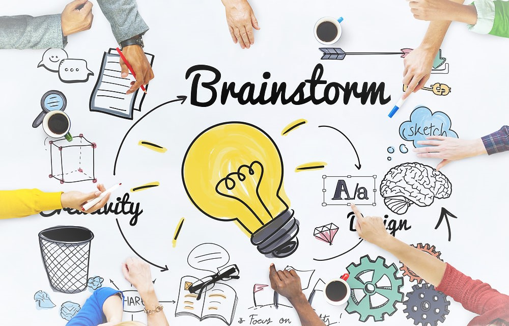
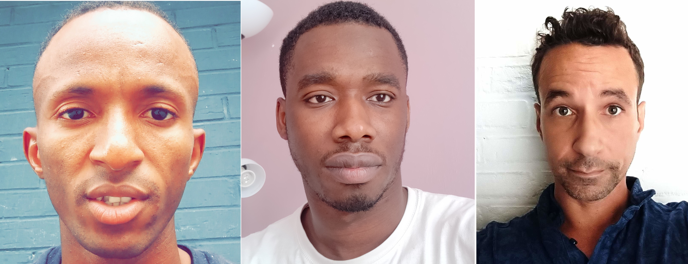

# Chatbot Game

[Link to the page](# Chatbot Game

[Link to the page](https://housseynou.github.io/Chatbot/. )

## The mission

* We have created a functional chatbot with Javascript language inside.

### The features inside our chatbot

* The chatbot has a simple UI interface with two lines and a button to send.
* It is programmed to have a small talk with the user.
#### How the chatbot works
* The chatbot welcomes the user with a randomly choses greeting (three different ones).
* After the login the chatbot asks the user how he or she feels today.
* The user can answer what he of she wants, the only thing that the bot does is finding a 'yes' or 'no' in the answer:
* * If he finds a yes he replies with a sentence chosen from three pre-programmed ones.
* * If he finds a no he replies the same way if he finds a yes.
* * If the robot doesn't find yes or no in the reply, it says it didn't understand and asks if he or she can say it again.
* * After three tries without a yes or no, the robot gets angry and gives an irritated answer.
* When the chatbot has done its routine, he says goodbye to the user and the text area returns to disabled mode.

## The steps we have made to make a chatbot

### Setting up things
* We have divided the tasks, but in the end it was a collaboration where everyone had a say in everything.
* First and foremost, we formed a group through Discord and then brainstormed about who played which role and what the UI should look like.

### The research
* We have been looking a lot for examples of chatbots that you can find on the internet.

### The Team

* Thierno Barry (left)
* Housseyno Coulibaly (middle)
* Jorge Vandereyken (right)
 )

## The mission

* We have created a functional chatbot with Javascript language inside.

### The features inside our chatbot

* The chatbot has a simple UI interface with two lines and a button to send.
* It is programmed to have a small talk with the user.
#### How the chatbot works
* The chatbot welcomes the user with a randomly choses greeting (three different ones).
* After the login the chatbot asks the user how he or she feels today.
* The user can answer what he of she wants, the only thing that the bot does is finding a 'yes' or 'no' in the answer:
* * If he finds a yes he replies with a sentence chosen from three pre-programmed ones.
* * If he finds a no he replies the same way if he finds a yes.
* * If the robot doesn't find yes or no in the reply, it says it didn't understand and asks if he or she can say it again.
* * After three tries without a yes or no, the robot gets angry and gives an irritated answer.
* When the chatbot has done its routine, he says goodbye to the user and the text area returns to disabled mode.

## The steps we have made to make a chatbot

### Setting up things
* We have divided the tasks, but in the end it was a collaboration where everyone had a say in everything.
* First and foremost, we formed a group through Discord and then brainstormed about who played which role and what the UI should look like.

### The research
* We have been looking a lot for examples of chatbots that you can find on the internet.

### The Team

* Thierno Barry (left)
* Housseyno Coulibaly (middle)
* Jorge Vandereyken (right)
